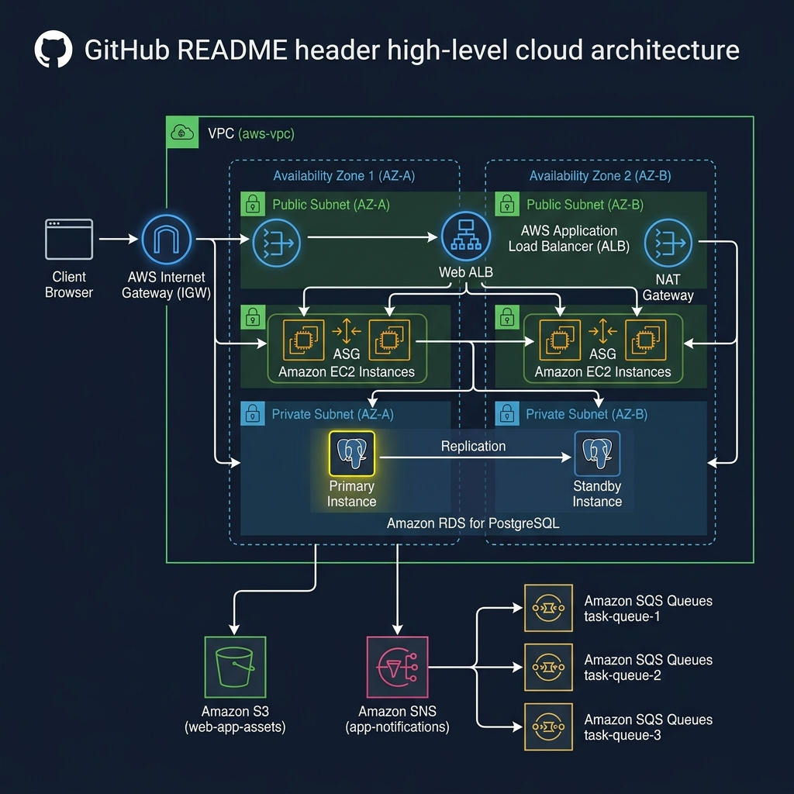

# Event-Driven Parcels Order System (TGTG PoC)

This project is a complete event-driven **Parcels Order System** (simulating the Too Good To Go backend architecture) built on a **Java 17 / Spring Boot** container and deployed to **Amazon Web Services (AWS)** using **Terraform (HCL)** or **Pulumi (YAML)**.

---

## 🏗️ High-Level Cloud Architecture



---

## 🎯 Why This Project Exists

This repository demonstrates production-grade backend design patterns and cloud infrastructure engineering:
1. **Event-Driven Architecture (EDA):** Utilizing **AWS SNS** (Publisher) and **AWS SQS** (Subscriber/Consumer) to implement asynchronous, loose-coupled message fan-out across multiple services (Notifications, Invoices, Delivery).
2. **High Availability & Auto Scaling:** Operating a scalable compute layer using an **Application Load Balancer (ALB)** and an **Auto Scaling Group (ASG)** that scales instances automatically between 1 and 3 servers depending on CPU utilization.
3. **Database Redundancy:** Running a **Multi-AZ PostgreSQL RDS** instance with synchronous replication to a standby instance in a separate Availability Zone (AZ) for automated failover.
4. **Cloud Storage & Temporary Security:** Storing dynamically generated documents in **AWS S3** and retrieving them via time-bounded **presigned URLs** to prevent public data exposure.
5. **Hexagonal Architecture (Ports & Adapters):** Keeping the core business logic independent of external databases, brokers, and cloud providers.
6. **Secure Compute Permissions:** Using **IAM Instance Profiles** to grant permissions to the EC2 container hosts, completely avoiding hardcoded AWS access keys.

---

## 🏗️ Detailed Architecture & Networking

The cloud infrastructure is provisioned in the **AWS Stockholm (`eu-north-1`)** region across multiple Availability Zones:

* **VPC Layer:** A custom VPC (`10.0.0.0/16`) to isolate all computing resources.
* **Public Subnets:** Spans two Availability Zones (`eu-north-1a` and `eu-north-1b`) to host the Application Load Balancer and the Auto Scaling Group instances.
* **Private Subnets:** Houses the PostgreSQL database (RDS), completely shielded from direct internet access.
* **Firewall Rules (Security Groups):** 
  * The **ALB Security Group** accepts public ingress HTTP (port 80) traffic.
  * The **EC2 Security Group** permits ingress HTTP (port 80) **only** from the Load Balancer, protecting instances from direct public bypass. It also permits restricted SSH (port 22) for deployment.
  * The **RDS Security Group** locks down PostgreSQL (port 5432) to accept traffic **only** from the EC2 security group.

---

## ⚙️ Scale & Resilience Policies

### ⚖️ Application Load Balancer (ALB)
The ALB acts as the single public entry point for your application. It receives user requests and distributes them evenly across the active EC2 instances in your Auto Scaling Group. If a server becomes unhealthy, the ALB automatically stops sending traffic to it.

### 📈 Auto Scaling Group (ASG)
Instead of operating a single vulnerable server, the application runs on a scalable pool of EC2 instances managed by an Auto Scaling Group:
* **Scale-Out Policy:** If the average CPU utilization of your running instances exceeds **70%** for more than 2 minutes, the ASG automatically boots up a new EC2 instance and registers it with the load balancer.
* **Scale-In Policy:** When the load drops and CPU utilization falls below **30%**, the ASG terminates the extra instances to optimize cloud costs.
* **Self-Healing:** If an instance crashes or stops responding to HTTP health checks, the ASG automatically terminates the broken instance and replaces it with a fresh one.

### 🗄️ Multi-AZ Database Redundancy
Your PostgreSQL database is configured with **Multi-AZ**. A secondary standby replica is maintained synchronously in a separate Availability Zone. If the primary database experiences a failure, AWS automatically promotes the standby replica to primary and redirects your application within 60 seconds with **zero data loss** and no code changes.

---

## 📁 Project Structure

* **`app/`**: The Spring Boot Java application & Docker setup.
  * `src/main/java/com/suleman/poc/`: Structured using **Hexagonal Architecture (Ports and Adapters)**:
    * `domain/model/`: Pure Java domain models (`Order`, `OrderStatus`, `OrderPlacedEvent`), independent of any framework.
    * `domain/ports/`: Interfaces decoupling domain logic from inputs and outputs.
      * `inbound/`: Use cases triggered by external inputs (`ManageOrdersUseCase`).
      * `outbound/`: Interfaces for external operations (`OrderRepositoryPort`, `OrderEventPublisherPort`, `InvoiceStoragePort`).
    * `domain/service/`: Implementation of the core domain business logic (`OrderServiceImpl`).
    * `adapters/`: Concrete implementations of ports:
      * `web/`: Inbound adapter (REST controller) exposing order endpoints and serving the UI.
      * `persistence/`: Outbound adapter wrapping Spring Data JPA for PostgreSQL.
      * `messaging/`: SNS publishers and SQS queue consumers (Notifications, Invoices, Delivery).
      * `storage/`: Outbound adapter mapping invoice uploads and presigning links to S3.
  * `src/main/resources/static/index.html`: A premium glassmorphic tracking dashboard UI displaying live order states, real-time logging, and presigned S3 download links.
  * `Dockerfile`: Multi-stage Docker build definition.
  * `docker-compose.yml`: For local development and testing.
  * `deploy.sh`: Script automating compilation, file copy, and remote container deployment on active ASG instances.
* **`pulumi/`**: Infrastructure configuration using Pulumi (YAML).
  * `Pulumi.yaml`: The declarative YAML-based infrastructure definition (VPC, Subnets, ALB, ASG, RDS, SNS, SQS, S3).
  * `Pulumi.dev.yaml`: Dev stack configurations (region details).
* **`terraform/`**: Infrastructure configuration using Terraform (HCL).
  * `providers.tf`: AWS provider specification.
  * `variables.tf`: Input variables (region, CIDRs, DB credentials).
  * `vpc.tf`: Networking (VPC, Subnets, Internet Gateway, DB Subnet Group).
  * `security_groups.tf`: Inbound and outbound firewall rules.
  * `rds.tf`: Database instance specification.
  * `ec2.tf`: Virtual server provisioning and Docker auto-setup.
  * `outputs.tf`: Outputs public IP, base URL, and database endpoint.

---

## 🚀 How to Run and Deploy

### 1. Local Development (Docker Compose)
To run and test the complete application stack locally on your computer:
1. Navigate to the `app/` folder:
   ```bash
   cd app
   ```
2. Build and start the containers:
   ```bash
   docker compose up --build
   ```
3. Open your browser and go to `http://localhost:8080` to access the live dashboard.

---

### 2. AWS Production Deployment

#### Prerequisites
* Install the AWS CLI and Terraform (or Pulumi).
* **AWS CLI Credentials Setup:** Configure your local terminal to access your AWS account:

##### A. Create an IAM User
1. Log in to your [AWS Management Console](https://console.aws.amazon.com/).
2. Search for **IAM** in the top search bar and click on it.
3. In the left navigation pane, click **Users**, then click **Create user**.
4. Set a username (e.g., `developer-cli`) and click **Next**.
5. Choose **Attach policies directly**, search for **`AdministratorAccess`**, check it, and click **Next** then **Create user**.

##### B. Generate Access Keys
1. Click on the username of the newly created user.
2. Navigate to the **Security credentials** tab.
3. Scroll down to the **Access keys** section and click **Create access key**.
4. Choose **Command Line Interface (CLI)**, check the confirmation box at the bottom, and click **Next** then **Create access key**.
5. Download the `.csv` file containing the **Access Key ID** and **Secret Access Key** (keep them secure!).

##### C. Configure the AWS CLI locally
1. Open your local terminal and run:
   ```bash
   aws configure
   ```
2. Enter the values when prompted:
   * **AWS Access Key ID:** Paste your Access Key ID.
   * **AWS Secret Access Key:** Paste your Secret Access Key.
   * **Default region name:** `eu-north-1` (Stockholm).
   * **Default output format:** `json`
3. Verify your setup:
   ```bash
   aws sts get-caller-identity
   ```

---

#### Deploying the Application

We use a fully automated orchestration script `deploy.sh` that provisions the cloud resources, extracts endpoints, compiles the Java code, and deploys the container onto the EC2 hosts:

1. Make sure you have configured your AWS CLI credentials (see Prerequisites above).
2. Navigate to the `app/` directory:
   ```bash
   cd app
   ```
3. Choose your preferred Infrastructure as Code (IaC) tool and run the deployment:
   * **To deploy via Terraform (Default):**
     ```bash
     chmod +x deploy.sh
     ./deploy.sh
     ```
   * **To deploy via Pulumi:**
     ```bash
     chmod +x deploy.sh
     ./deploy.sh --pulumi
     ```
4. The script will automatically:
   * Provision/update the cloud infrastructure via Terraform or Pulumi.
   * Dynamically query the newly generated Load Balancer (ALB) URL, active EC2 Auto Scaling IPs, and S3 bucket details.
   * Write and synchronize these values to your local `.env` configuration file.
   * Compile your Java Spring Boot application into a JAR.
   * Copy the build artifact to your active EC2 server and deploy the Docker container live.

5. Open the **Load Balancer URL** printed in your terminal output in your browser to view your live tracking dashboard!

## 🎨 Visual Infrastructure & AI Assistants

This project supports modern visual design and AI generation tools for rapid cloud engineering:

### 1. Visual Drag-and-Drop (Brainboard)
Instead of writing Terraform code manually, you can manage and visualize this entire infrastructure dynamically:
* **Interactive Canvas:** Open the [Live Brainboard Design Board](https://app.brainboard.co/a/1edfbcaf-db32-4be2-bb9c-105a63174f2e/design) for this project.
* **Bi-directional Sync:** Drag-and-drop new AWS resources or connect existing ones on the canvas, and Brainboard will instantly generate the equivalent Terraform code.
* **Reverse Engineering:** You can import changes from the `/terraform` folder in this repository back into Brainboard to auto-update the diagram.

### 2. AI Infrastructure Copilots (Pulumi Neo / Pulumi AI)
If you need to make changes or build out further infrastructure options:
* **Pulumi AI:** Access [pulumi.com/ai](https://www.pulumi.com/ai) and describe your changes in plain English (e.g., *"Add a CloudWatch alarm to trigger auto-scaling when CPU exceeds 80%"*). It will output the complete code block in Pulumi YAML.
* **Pulumi Neo:** Use the interactive terminal agent (`pulumi neo`) in your command line for live, contextual help with stack diagnostics and upgrades.

---

## 🧹 Cleaning Up Resources

To destroy all created resources and avoid any unexpected cloud charges:

* **If deployed via Terraform (Default):**
  1. Navigate to the `terraform/` directory:
     ```bash
     cd terraform
     ```
  2. Run the destroy command (confirm with `yes`):
     ```bash
     terraform destroy
     ```

* **If deployed via Pulumi:**
  1. Navigate to the `pulumi/` directory:
     ```bash
     cd pulumi
     ```
  2. Run the destroy command (confirm with `yes`):
     ```bash
     export PULUMI_CONFIG_PASSPHRASE="SecurePass123!"
     pulumi destroy --yes
     ```
